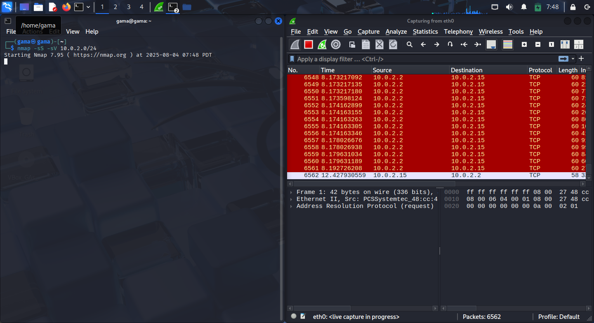
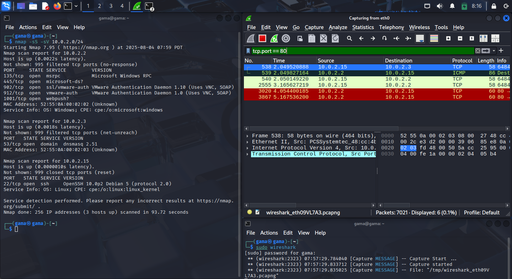

# Network Reconnaissance & Traffic Analysis with Nmap and Wireshark: An Offensive Security Lab

Master the basics of ethical hacking by identifying open ports, fingerprinting services, and monitoring scan traffic—all on your local network!

---

## 🚀 Project Objective

To simulate attacker reconnaissance on a local network using **Nmap** and **Wireshark**.  
This lab covers:  
- Discovering devices & open ports  
- Identifying running services  
- Capturing and filtering scan traffic  
- Analyzing potential security exposures  

---

## 🛠️ Tools & Environment

- **Nmap** – Fast, flexible network scanner  
- **Wireshark** – Advanced packet analyzer  
- **Linux Terminal** – Any Debian-based distro (e.g., Ubuntu, Kali)  
- **Local Network** – Target subnet: `10.0.2.0/24` (adjust as needed)  

---

## 📋 Step-by-Step Offensive Reconnaissance

### 1️⃣ Nmap Installation
```sh
sudo apt install nmap -y
```


---

### 2️⃣ Identify Your Local IP Range
```sh
ifconfig
```


---

### 3️⃣ SYN Stealth Scan: Discover Hosts & Open Ports
```sh
nmap -sS 10.0.2.0/24
```


---

### 4️⃣ Service & Version Detection: Fingerprint Running Services
```sh
nmap -sS -sV 10.0.2.0/24
```


---

### 5️⃣ Save Scans for Reporting
Plain text format:
```sh
nmap -sS 10.0.2.0/24 -oN scan_results.txt
```
XML format:
```sh
nmap -sS 10.0.2.0/24 -oX scan_results.xml
```
- [scan_results.txt](scan_results.txt)
- [scan_results.xml](scan_results.xml)
\


---

### 6️⃣ Deep Dive: Capture Scan Traffic with Wireshark

#### a. Launch Wireshark
```sh
wireshark
```


#### b. Simultaneously Run Nmap Scan from Another Terminal
```sh
nmap -sS -sV 10.0.2.0/24
```

#### c. Apply Key Filters for Analysis

- **SYN packets (scan attempts):**
  ```
  tcp.flags.syn == 1 and tcp.flags.ack == 0
  ```
  

- **Specific port (e.g., 80):**
  ```
  tcp.port == 80
  ```
  

- **Filter by scanning host (e.g., 10.0.2.15):**
  ```
  ip.addr == 10.0.2.15
  ```
  

---

## 📦 Packet Capture Evidence

The full Wireshark packet capture from the Nmap scan is provided for review and analysis:
- [Wireshark Capture.pcap](wireshark_capture.pcap)

Open this file in Wireshark to:
- See raw SYN packets and probe traffic.
- Apply the same filters explained above (`tcp.flags.syn == 1 and tcp.flags.ack == 0`, `tcp.port == 80`, etc).
- Validate and explore results on your own.

---

## 📊 Results & Security Insights

This section showcases real-world findings and actionable insights from our Nmap scans and Wireshark traffic captures.

### 🖥️ Devices & Open Ports Discovered

- Three hosts detected in the subnet `10.0.2.0/24`:
  - **10.0.2.2** (Windows)
    - Open ports: 135/tcp (msrpc), 902/tcp (VMware-auth), 912/tcp (VMware-auth), 1001/tcp (webpush)
    - Service Info: Microsoft Windows RPC, VMware Authentication
    - MAC Address: 52:55:00:aa:00:02
  - **10.0.2.3**
    - Open port: 53/tcp (dnsmasq 2.51)
    - MAC Address: 52:55:00:aa:00:02
  - **10.0.2.15** (Linux)
    - Open port: 22/tcp (OpenSSH 10.0p2 Debian 5)
    - Service Info: Linux kernel, OpenSSH
    - MAC Address: 52:55:00:aa:00:02

---

### 🔎 Service Fingerprinting

- Nmap’s `-sV` flag revealed:
  - Precise versions of running services  
  - OS fingerprinting via CPE strings  
  - Fast identification of network exposures  

---

### 🛡️ Security Implications

- **Windows Host (10.0.2.2)** exposes critical services (RPC, VMware Auth) that can be targeted for privilege escalation or lateral movement.
- **Linux Host (10.0.2.15)** exposes SSH, a common vector for brute-force attacks if not properly secured.
- **DNS Service (10.0.2.3)**, if misconfigured, could be vulnerable to cache poisoning or amplification attacks.

---

### 🕵️ Wireshark Traffic Analysis

- **SYN packets** observed during Nmap scans (filter: `tcp.flags.syn == 1 and tcp.flags.ack == 0`), confirming stealth scan technique.
- **Port-specific traffic** filtered for port 80 (filter: `tcp.port == 80`), showing targeted probe attempts.
- **Source host filtering** (filter: `ip.addr == 10.0.2.15`), revealing all traffic originating from the scanning device.

---

### 📝 Key Takeaways

- **Exposed services** are quickly identified and fingerprinted using basic Nmap and Wireshark techniques.
- **Network defenders** can use Wireshark filters to spot reconnaissance activity in real time.
- **Best practices:** Minimize exposed ports, keep services patched, monitor for unusual SYN traffic, and use strong authentication.

---

*These results underscore the importance of regular internal scans and active network monitoring for early detection of threats and exposures.*

---

## 🔁 How to Reproduce

1. Clone this repository
2. Install Nmap and Wireshark
3. Follow the above steps on your own LAN/subnet
4. Compare your output to included scan results and screenshots

---

## 📚 References

- [Nmap Book & Docs](https://nmap.org/book/man.html)
- [Wireshark Docs](https://www.wireshark.org/docs/)
- [Linux Networking Basics](https://wiki.debian.org/NetworkConfiguration)

---

> **This lab demonstrates foundational skills for network penetration testing and blue-team defense. Perfect for cyber security students, interns, and practitioners!**